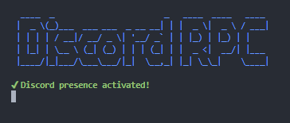

# Presencia RPC



Este es un sencillo script en JS para configurar una RPC personalizada en Discord utilizando la biblioteca [`discord-rpc`](https://www.npmjs.com/search?q=discord-rpc).

## Requisitos

- [Node.js](https://nodejs.org/) (versión 12.0.0 o superior)
- [Discord Developer Portal](https://discord.com/developers/applications) para crear una aplicación de Discord

## Instalación

1. Clona este repositorio en tu máquina local:

   ```bash
   git clone https://github.com/Yukisuhii/Discord-Prensencia-RPC.git
   cd Discord-Presencia-RPC
   ```

2. Instala las dependencias del proyecto (ya sea con NPM, Yarn o PNPM)

   ```bash
   npm i
   ```

3. Ve al [Portal de desarrolladores de Discord](https://discord.com/developers/applications), crea una nueva aplicación y copia el **ID de la aplicación**.

4. Reemplaza la constante `ID` en el archivo del script con el ID de tu aplicación de Discord.

## Configuración de la presencia

En el archivo del script, puedes personalizar los detalles del RPC modificando las siguientes propiedades:

- `details`: Texto que aparecerá en la parte superior de la presencia
- `state`: Texto adicional que aparece debajo de los detalles
- `buttons`: Array con hasta 2 botones personalizables, cada uno con su `label` (texto) y `url` (enlace)

Si deseas imágenes, en los campos que pongan `ImageKey` tienes dos opciones, poner la URL de una imagen o usar assets que hayas subido previamente a tu aplicación (en cuyo caso solo indicas el nombre)

- `largeImageKey`: Nombre/URL del archivo de la imagen grande
- `largeImageText`: Texto que aparece al pasar el mouse sobre la imagen grande
- `smallImageKey`: Nombre/URL del archivo de la imagen pequeña
- `smallImageText`: Texto que aparece al pasar el mouse sobre la imagen pequeña

En caso de que no quieras un valor, puedes simplemente eliminarlo.

## Uso

Para iniciar ejecuta el siguiente comando:

```bash
node index.js
```

## Contribuciones

Las contribuciones son bienvenidas. Siéntete libre de hacer un fork de este repositorio

## Licencia

Este proyecto está licenciado bajo la licencia Apache 2.0, Puedes ver más detalles en el archivo `LICENSE`.
